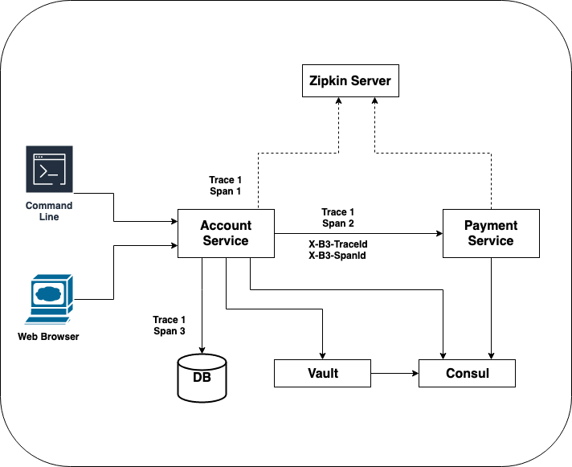

# Opinionated Spring Boot Solutions To Common Concerns In Distributed System

## Goal

The goal of this repository is to illustrate how to solve common concerns a typical application would face in a distributed environment by using open source solutions with little or no configurations.

The focus is on using open source libraries that are developed to work with Spring Boot application such that the same solution can be applied to other Spring Boot applications with little or no effort. Developers can then focus on application and business logic. 

### What is Being Addressed?

1. request and response logging
2. distributed tracing
3. API endpoint client
4. service discovery
5. configuration management
6. secret management (TBD)

### What Is Not Being Addressed?

The solutions described here are not specifically for running application in the Cloud environment and/or in Kubernetes cluster. To take advantage of Cloud and/or Kubernetes, a different set of solutions are recommended and is covered in `yet-to-defined` repository.

### But Opinionated?

Every problem can likely be solved differently and this is a good thing. The goal is not to convince anyone this solution is better or worse than any other solution but rather seves the purpose of providing a working solution. As technology evolves, what is considered a best/better solution is going to evolves as well. In other words, the opinionated solution provided here likely has an expiration date associated with it.


## Contrived Example

In this repo, ideas and solutions are illustrated by applying them to a contrived example. There is not much real business related functionality implemented and the idea of the example is to have multiple services working together to loosely reflect a real world scenario.




## 1. Request & Response Logging

[Logbook](https://github.com/zalando/logbook) is a Java library for HTTP request and response logging. The features it supports and flexibility it provides makes it a good solution to be included.

### Features

* Logging of HTTP request and response, including body, partial body or none at all.
* Different logging format: json, http, curl, etc
* Obfuscation of sensitive data
* Customization: including inclusion and/or exclusion of endpoints and others
* Auto configuration for Spring Boot application

### Configuration

**`pom.xml`**
```
<dependency>
    <groupId>org.zalando</groupId>
    <artifactId>logbook-spring-boot-starter</artifactId>
    <version>${logbook.version}</version>
</dependency>
```

**Sample configuration in `application.yaml`**
```
logbook:
  format:
    style: json
  include:
    - /accounts/**
  exclude:
    - /favicon.ico
    - /actuator/**
logging:
  level:
    ROOT: INFO
    org:
      zalando:
        logbook: TRACE
```

**Sample Log Messages**

Incoming Log
```
payment-service_1  | 2019-05-28 00:33:05.947 TRACE [payment-service,32cf62ffab4de32b,fcfe924a3b3a35c6,true] 1 --- [nio-8080-exec-1] org.zalando.logbook.Logbook              : {"origin":"remote","type":"request","correlation":"8be56ded8745bf16","protocol":"HTTP/1.1","remote":"172.23.0.4","method":"GET","uri":"http://payment-service:8080/paymentInfo/accounts/123","headers":{"accept":["*/*"],"connection":["keep-alive"],"content-type":["application/json"],"host":["payment-service:8080"],"user-agent":["Java/11.0.3"],"x-b3-parentspanid":["32cf62ffab4de32b"],"x-b3-sampled":["1"],"x-b3-spanid":["fcfe924a3b3a35c6"],"x-b3-traceid":["32cf62ffab4de32b"]},"body":}
```

After Re-formatting
```
{
  "origin": "remote",
  "type": "request",
  "correlation": "8be56ded8745bf16",
  "protocol": "HTTP/1.1",
  "remote": "172.23.0.4",
  "method": "GET",
  "uri": "http://payment-service:8080/paymentInfo/accounts/123",
  "headers": {
    "accept": [
      "*/*"
    ],
    "connection": [
      "keep-alive"
    ],
    "content-type": [
      "application/json"
    ],
    "host": [
      "payment-service:8080"
    ],
    "user-agent": [
      "Java/11.0.3"
    ],
    "x-b3-parentspanid": [
      "32cf62ffab4de32b"
    ],
    "x-b3-sampled": [
      "1"
    ],
    "x-b3-spanid": [
      "fcfe924a3b3a35c6"
    ],
    "x-b3-traceid": [
      "32cf62ffab4de32b"
    ]
  },
  "body": ""
}
```


Outgoing Log
```
payment-service_1  | 2019-05-28 00:33:07.123 TRACE [payment-service,32cf62ffab4de32b,fcfe924a3b3a35c6,true] 1 --- [nio-8080-exec-1] org.zalando.logbook.Logbook              : {"origin":"local","type":"response","correlation":"8be56ded8745bf16","duration":1242,"protocol":"HTTP/1.1","status":200,"headers":{"Content-Type":["application/json;charset=UTF-8"],"Date":["Tue, 28 May 2019 00:33:07 GMT"],"Transfer-Encoding":["chunked"]},"body":{"id":123,"date":"2019-05-28T00:33:07.014+0000"}}
```
After Re-formatting
```
{
  "origin": "local",
  "type": "response",
  "correlation": "8be56ded8745bf16",
  "duration": 1242,
  "protocol": "HTTP/1.1",
  "status": 200,
  "headers": {
    "Content-Type": [
      "application/json;charset=UTF-8"
    ],
    "Date": [
      "Tue, 28 May 2019 00:33:07 GMT"
    ],
    "Transfer-Encoding": [
      "chunked"
    ]
  },
  "body": {
    "id": 123,
    "date": "2019-05-28T00:33:07.014+0000"
  }
}
```

## 2. Distributed Tracing

A common requirement for services in distributed system is the ability to trace requests sent/received between services and understand where most time is spent. This is espically important when serving a request involves multiple services and the interaction between them is too complex to comprehend easily.


[Spring Cloud Sleuth](https://github.com/spring-cloud/spring-cloud-sleuth) is a distributed tracing tool for Spring Cloud. It instruments Spring components to collect trace information and can optionally send it to a Zipkin server for visualization.

[Zipkin](https://github.com/apache/incubator-zipkin) is a distributed tracing system. It helps collecting tracing data, storing, lookup and visualization. Zipkin also provides a Spring Boot based server.


### Features of Spring Cloud Sleuth

* Trace and span IDs are added to Slf4J MDC and available in the log message.
* Timing information is available for latency analysis.
* [OpenTracing](https://opentracing.io/) compatible


### Configuration

**`pom.xml`**

```
<dependencies>
    <dependency>
        <groupId>org.springframework.cloud</groupId>
        <artifactId>spring-cloud-starter-sleuth</artifactId>
    </dependency>

    <dependency>
        <groupId>org.springframework.cloud</groupId>
        <artifactId>spring-cloud-starter-zipkin</artifactId>
    </dependency>
</dependencies>

<dependencyManagement>
    <dependencies>
        <dependency>
            <groupId>org.springframework.cloud</groupId>
            <artifactId>spring-cloud-dependencies</artifactId>
            <version>${spring-cloud.version}</version>
            <type>pom</type>
            <scope>import</scope>
        </dependency>
    </dependencies>
</dependencyManagement>     
```

**Sample configuration in `application.yaml`**
```
spring:
  application:
    name: Account
  sleuth:
    sampler:
      # demo purpose only
      probability: 1.0
  zipkin:
    # zipkin server location
    base-url: http://localhost:9411
    enabled: true
    service:
      name: account-service
```

### HTTP Headers

* X-B3-SpanId
* X-B3-TraceId
* X-B3-ParentSpanId
* X-Span-Export

### How Does It Work

A new Trace ID will be created automatically the first time a request is entering into the system. As part of processing the same request, a new Span ID will be created automatically every time a process is interacting with external services (including but not limited to database, queue, etc). Those trace and span information are sent over to Zipkin server for storage and analysis.  


## 3. API Endpoint Client

A typical communication mechanism between services is through HTTP. For a sending side to communicate with the receiving side, there are a few options to be considered:

* [Swagger Codegen](https://swagger.io/tools/swagger-codegen/)
* Hand crafted Interface class by the sending service.
* Model classes packaged in a module or library provided by the receiving service.
* Declarative REST Client using Spring Cloud OpenFeign


To quickly implement the communication solution, [Spring Cloud OpenFeign](https://spring.io/projects/spring-cloud-openfeign) is a solution to be considered. It requires few little configuration and implementation effort. 

### Configuration

**`pom.xml`** (on the sending service side)
```
<dependency>
    <groupId>org.springframework.cloud</groupId>
    <artifactId>spring-cloud-starter-openfeign</artifactId>
</dependency>

<dependency>
    <groupId>org.springframework.cloud</groupId>
    <artifactId>spring-cloud-starter-netflix-ribbon</artifactId>
</dependency>
```        

**Sample configuration in `application.yaml`** (on the sending service side)

```
#1 feign configuration
feign:
  okhttp:
    enabled: false
  httpclient:
    enabled: true
  client:
    config:
      # payment service connection configuration
      payment:
        connectTimeout: 5000
        readTimeout: 10000
        loggerLevel: full

client:
  payment:
    name: payment
    url: http://localhost:8081
```    

**Sample Spring Configuration** (on the sending service side)

```
@FeignClient(name = "payment", url = "${client.payment.url}")
public interface PaymentClient {
    // #2 endpoint declaration
    @RequestMapping(method = RequestMethod.GET, value = "/paymentInfo/accounts/{accountId}", consumes = "application/json")
    // #3 response class is defined on the sending side
    PaymentInfo getPaymentInfo(@PathVariable long accountId);
}
```

**API Endpoint Response Class** (on the sending service side)
```
// #3
public class PaymentInfo {
    long id;
    Date date;
}
```

**Note**

* **#1** receiving service configuration is defined in application.yaml file
* **#2** API endpoint definition is declared here
* **#3** API endpoint response class is defined on the sending side

### Discussion

* The solution decouples the services. Sending service does NOT need to depend on receiving service. Software release can then be done with less coupling.
* Declarative configuration is easier than code generation.
* Spring Cloud OpenFeign does depend on a Client Load Balancer solution. For it to work, an additional dependency (Ribbon) is also brought in as well. Whether or not using Client Load Balancer together in the Spring Boot application is recommended is up for debate.


## 4. Service Discovery

[Consul](https://www.consul.io/) provides a Key/Value Store for storing configuration and other metadata. In additional to that, Consul also provides **Service Discovery** and **Health Checking** functionalities. 

[Spring Cloud Consul](https://spring.io/projects/spring-cloud-consul) is chosen to provide Consul integrations for Spring Boot application. When application starts up, it registeres with Consul server and retrieves configuration data from it. Once registered, Consul performs health check on a regular basis and allows other applications to discover this service. When configuration data is updated, application can also discover the change by using Config Watch which runs on a configurable interval.

### Configuration

**`pom.xml`** 
```
<dependency>
    <groupId>org.springframework.cloud</groupId>
    <artifactId>spring-cloud-starter-consul-all</artifactId>
</dependency>
```

**Sample configuration in `bootstrap.yaml`**

The Consul configuration shown here assumes Consul Server is reachable at localhost. Dependents on the configuration, a Consul Agent running at localhost is more likely a better choice. Consul Agent then communicates with Consul Server on behave of the application so that application does not need to know where and how to communicate to Consul Server.


```
spring:
  application:
    name: Account
  cloud:
    consul:
      host: localhost
      port: 8500
      discovery:
        # to have unique name in Consul
        instance-id: ${spring.application.name}:${random.value}
      config:
        enabled: true
        watch:
          # delay in milliseconds, the frequency of when ConfigWatch is called
          delay: 1000
        prefix: config
```

The **DiscoveryController** class has sample code to demonstrate how to use **DiscoveryClient** to find out the network location of the dependent service.


## 5. Configuration Management

### Configuration

**Sample configuration in `bootstrap.yaml`**

```
spring:
  application:
    name: Account
  cloud:
    consul:
      host: localhost
      port: 8500
      config:
        enabled: true
        watch:
          # delay in milliseconds, the frequency of when ConfigWatch is called
          delay: 1000
        prefix: config
```

**Configuration Data In Consul Key/Value Store**

Configure a key/value pair with the following information

|Key|Value|
|---|---|
|config/Account/custom.description|some value|


Note on the key format:
  * `config` is the prefix configured in **bootstrap.yaml** file under `spring.cloud.consul.config.prefix`.
  * Service name is `Account` and is case sensitive
  * `custom.description` maps to the Configuration Properties class shown below


**Configuration Property Class**

All the properties are encapsulated in the **CustomProperties** class and **ConfigurationProperties** annotation is configured with value `custom`. With this configuration, each key configured in Consul will have the `custom.{KEY_NAME}` format. An example of key would be `custom.description`.

```
@RefreshScope
@Configuration
@ConfigurationProperties("custom")
public class CustomProperties {
    private String description;
}
```

Note:
* With `RefreshScope` annotation, Config Watch will watch changes in Consul and update value accordingly.


## Run All The Services

When running each service individually (not using `docker-compose`), Account Service is running at `localhost:8080` and Payment Service is running at `localhost:8081`. Zipkin is assumed to be available at `localhost:9411` and Consul is available at `localhost:8500`.


If you would like to build the services as container, a Dockerfile has been provided for each service.

Execute the following command to build container image for all services.

```
docker-compose build
```

A `docker-compose.yaml` has been provided to run all services on the host where docker and docker-compose are available.

```
docker-compose up -d
```

After all services are up and running, 

**Account Service** 

Account Service is available at `http://localhost:8080`

To retrieve account information for an account id:

```
http://localhost:8080/accounts/123
```


**Payment Service**
Payment Service is available at `http://localhost:8081`

To retrieve payment information for account of id 

```
http://localhost:8081/paymentInfo/accounts/123
```

**Zipkin Server**

Zipkin is available at `localhost:9411`

**Consul**

Consul UI is available at `localhost:8500`


## Continuous Integration: Google Cloud Build

A Cloud Build `cloudbuild.yaml` file has been provided and the github repository has been configured to have a build triggered every time there is a commit pushed to any branch.

Inside `cloudbuild.yaml`, a Docker Cloud Builder is used to execute the `docker build` command for each service using the respective `Dockerfile`.

It is possible to extend this file to also push container image to a container registry such as GCR. 

## Continuous Integration: Gitlab CICD

A `.gitlab-ci.yaml` file has been provided such that a build will be triggered every time a commit is pushed to any branch. What it currently does is to build each service using the provided `Dockerfile. It is possible to extend current pipeline to push container images to container register or deploy to target environment.